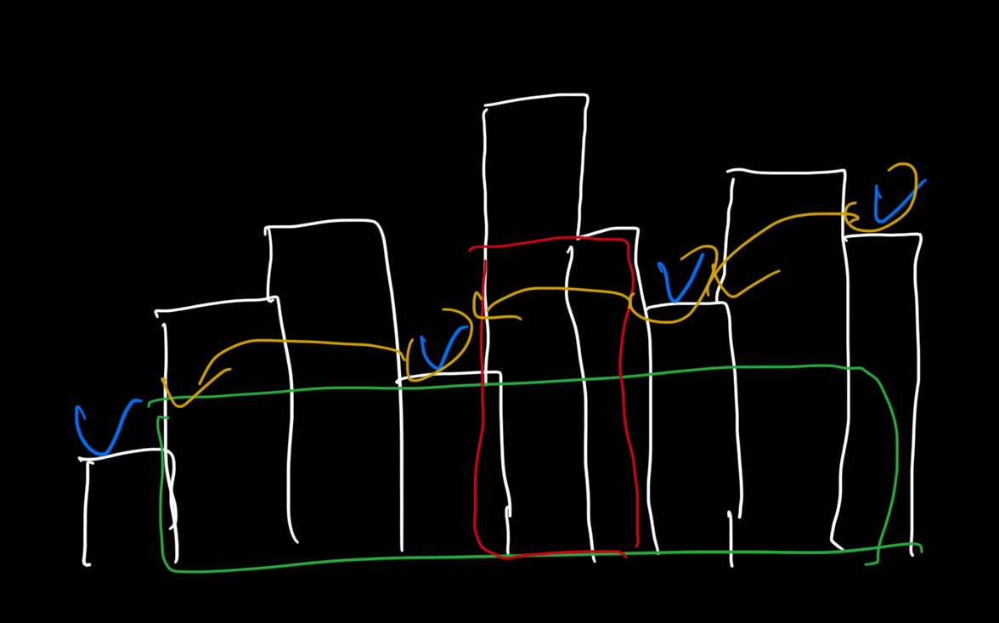

# largestRectangleArea

## Explain Problem

<https://leetcode.com/problems/largest-rectangle-in-histogram/>

* Tag
  * Array
  * Stack
  * Monotonic Stack
* Acceptable : 41.2%
* Difficulty : Hard

```plain
Input: heights = [2,1,5,6,2,3]
Output: 10
Explanation: The above is a histogram where width of each bar is 1.
The largest rectangle is shown in the red area, which has an area = 10 units.
```

```plain
Input: heights = [2,4]
Output: 4
```

## Solution

일단 맨 처음에 푸는 방식은 2개의 포인터를 이용해서, 배열의 처음과 끝을 생각하고 값을 곱하는 공식으로 접근했다.

```python
# TLE (two pointer)
class Solution:
    def largestRectangleArea(self, heights: List[int]) -> int:
        result = 0
        for i in range(len(heights)):
            for j in range(i+1, len(heights)+1):
                area = (j - i) * min(heights[i:j])
                result = max(result, area)
        return result
```

문제는 역시 O(n^2)의 시간 복잡도를 가지므로, Timeout이 발생하였고,  
문제의 Tag를 주목하여 monotonic stack을 확인해보았다.  

### Monotonic Stack

스택의 top에 있는 숫자와 새롭게 들어오는 숫자를 비교하고, 경우에 따라 pop하며 진행

* **중복없는 오름차순 스택**인경우, 들어가려는 수가 top 보다 작거나 같은 경우 오름차순을 만족할 때까지 pop을 반복 한 후 push.
* **중복없는 내림차순 스택**인경우, 들어가려는 수가 top 보다 크거나 같은 경우 내림차순을 만족할 때까지 pop을 반복한 후 push.

예제 코드는 다음과 같다.

```python
arr = [5, 19, 46, 20, 10, 16, 18, 15, 15, 29, 47, 20]
stack = []

for i in range(len(arr)):
    while stack and stack[-1] >= arr[i]:
        stack.pop()
    stack.append(arr[i])
    print(i, arr[i], stack)

print(stack)
```

```plain
0 5 [5]
1 19 [5, 19]
2 46 [5, 19, 46]
3 20 [5, 19, 20]
4 10 [5, 10]
5 16 [5, 10, 16]
6 18 [5, 10, 16, 18]
7 15 [5, 10, 15]
8 15 [5, 10, 15]
9 29 [5, 10, 15, 29]
10 47 [5, 10, 15, 29, 47]
11 20 [5, 10, 15, 20]
[5, 10, 15, 20]
```



조금 더 간단히 설명하기 위해서 예시로 든 그림이다.  
monotonic stack으로 구한 값과 각 index를 구할수 있으면 세로로 펼쳐진 초록색 사각형의 넓이를 구할수 있고,  
각 인덱스에서 pop을 하는 경우에 높이와 인덱스를 구해서 곱하면 마찬가지로 세로로 긴 빨간색 공간의 넓이를 구할수 있다.  

monotonic Stack의 경우 보통 문제에서 높이와 인덱스간 넓이를 구하는 경우에 많이 쓰인다고 한다.
이것을 토대로 코드를 작성해보면

```python
class Solution:
    def largestRectangleArea(self, heights: List[int]) -> int:
        stack = []
        maxArea = 0
        for i in range(len(heights)):
            startIdx = i
            while stack and stack[-1][1] > heights[i]:
                idx, height = stack.pop()
                # Red Area
                maxArea = max(maxArea, height * (i - idx))
                startIdx = idx
            stack.append((startIdx, heights[i]))
        
        # Green Area
        for startIdx, height in stack:
            maxArea = max(maxArea, height * (len(heights) - startIdx))
            
        return maxArea
```

이런식으로 구현할 수 있게 된다.

* Runtime: **2170 ms**
* Memory Usage: **30.4 MB**

이 경우 시간복잡도는 O(n)가 되는데, 공간 복잡도도 O(n)이 되게된다.

그 외에 풀이 방법을 찾아보면 다음과 같이 DFS로 구현한 것을 찾아냈다.

```python
class Solution:
    def largestRectangleArea(self, heights: List[int]) -> int:
        return self.calFromMin(0, len(heights) - 1, heights)
    
    def calFromMin(self, startIdx, endIdx, heights):
        if startIdx > endIdx:
            return 0
        minIdx = self.getMinIdx(startIdx, endIdx, heights)
        
        return max(heights[minIdx] * (endIdx - startIdx + 1), 
                   self.calFromMin(startIdx, minIdx - 1, heights),
                   self.calFromMin(minIdx + 1, endIdx, heights))
    
    def getMinIdx(self, startIdx, endIdx, heights):
        currentMin = float('inf')
        minIdx = -1
        for i in range(startIdx, endIdx + 1):
            if heights[i] < currentMin:
                currentMin = heights[i]
                minIdx = i
        return minIdx
```

이 경우 제일 작은 index를 찾고, 해당 인덱스를 기준으로 좌우를 재귀 형식으로 비교하며, 곱셈을 수행하게 되고, 해당 곱셈 값들의 최대 값을 출력하는 로직이다.  
시간 복잡도의 경우 O(n log n)이 될 것이고, 공간복잡도의 경우엔 O(log n)이 될것이라고 생각한다.

다만 이 경우도 Timeout이 났는데, 똑같은 테스트케이스에서 에러가 발생했다.
<https://leetcode.com/submissions/detail/737244885/testcase/>

아마 이 케이스가 추가되기 이전 풀이인거같다.

## Reference

<https://nooblette.tistory.com/258>
